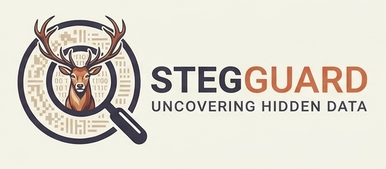

# StegGuard

<p align="center">
  
</p>

**Find what is hiding in plain sight.**

[](https://www.python.org/)
[](LICENSE)
[](pyproject.toml)

StegGuard is a local-first toolkit for finding, decoding, and safely removing
hidden content from files. It looks beyond ordinary metadata and scans for
invisible Unicode, whitespace channels, homoglyphs, suspicious media
structures, watermark signals, fingerprints, and Content Credentials.

It runs on the Python standard library, stays offline by default, and explains
what it found in JSON and HTML reports you can actually hand to another person.

StegGuard is alpha software. Treat its findings as investigative evidence, not
as an infallible verdict.

## See it work

The repository includes a deterministic, harmless demo. It hides the word
`DEMO` in zero-width characters, detects and decodes it, writes a sanitized
copy, verifies the result, and analyzes a synthetic PNG for watermark and
provenance signals.

```bash
python3 demo/run_demo.py
```

Expected ending:

```text
Demo completed successfully
Decoded hidden text: DEMO
Original preserved: True
Reports: .../demo-output/reports
Summary: .../demo-output/summary.json
```

The demo makes no network requests and contains no executable or malicious
payload. Open `demo-output/reports/detect.html` after the run to inspect the
report. See [the demo guide](demo/README.md) for every generated artifact.

## Why StegGuard exists

Hidden content is rarely one neat payload in one neat format. It can be a
zero-width message in a prompt, a Cyrillic character in a source file, trailing
spaces in a document, bytes after a media container, a private PNG chunk, or a
provenance claim that exists but has never been cryptographically validated.

Most tools handle one of those cases. StegGuard gives them a shared workflow:

```text
untrusted file -> detect -> inspect -> decode -> sanitize a copy -> verify
```

The original stays untouched unless you explicitly authorize an in-place
replacement.

## Install

When a release is available on PyPI:

```bash
python3 -m pip install stegguard
```

From source:

```bash
git clone https://github.com/stegguard/stegguard.git
cd stegguard
python3 -m pip install -e .
```

StegGuard requires Python 3.12 or newer and has no mandatory runtime
dependencies.

For wider image-format decoding through the explicitly tested Pillow path:

```bash
python3 -m pip install "stegguard[images]"
```

The supported Python range is 3.12 through 3.14. CI is configured for Linux,
macOS, and Windows; hosted results are required before those targets are
described as verified. Architecture details and current evidence are in
[docs/platform-support.md](docs/platform-support.md).

## Quick start

Scan one file:

```bash
stegguard detect suspicious.py
```

Scan a repository and save both report formats:

```bash
stegguard detect ./repo -r --json findings.json --html report.html
```

Decode recognized text-carried channels without modifying the source:

```bash
stegguard decode suspicious.txt
```

Write a sanitized copy and receive hashes, change counts, and a unified diff:

```bash
stegguard sanitize suspicious.txt
```

Analyze watermark and provenance signals:

```bash
stegguard watermark image.png --json watermark.json --html watermark.html
```

Validate Content Credentials with the official `c2patool` executable:

```bash
stegguard watermark image.png --c2pa-tool c2patool --html provenance.html
```

## Commands

| Command | What it does |
| --- | --- |
| `stegguard detect` | Scans files or directories for hidden-content signals |
| `stegguard decode` | Extracts recognized text-carried payloads without changing the input |
| `stegguard sanitize` | Writes a safer copy and reports every change |
| `stegguard watermark` | Analyzes watermark, fingerprint, and provenance evidence |

Run `stegguard COMMAND --help` for command-specific options.

For `detect`, exit status `0` means a completed clean scan, `1` means a
completed scan with findings, and `2` means invalid input or an incomplete
scan. The complete compatibility contract is in
[docs/compatibility.md](docs/compatibility.md).

## What it detects

### Text and source files

- Zero-width and invisible Unicode characters
- Bidirectional controls and suspicious formatting characters
- Cyrillic and Greek homoglyphs
- Trailing-space and tab channels, including SNOW-style patterns
- Mixed and encoded line-ending patterns
- Repeated punctuation, spacing, and layout intervals

### Images, audio, and structured media

- Pixel-level LSB anomalies as a distinct detection category
- Transform and block-correlation signals in decodable lossless images
- Phase, echo, spectral, spread-spectrum, and silence-interval statistics in
  PCM WAV audio
- PNG metadata, private chunks, and appended data
- JPEG EXIF, XMP, and IPTC indicators
- RIFF trailing data, ISO BMFF private boxes, and PSD structures
- Pluggable analyzers for compressed codecs, keyed schemes, and video

### Documents and containers

- PDF embedded files and active or hidden structures
- DOCX, PPTX, XLSX, ZIP, and compatible archive members
- Nested media and archives with bounded member and decompression limits
- SVG and HTML comments, hidden styles, and external references

### Watermarks and provenance

- Metadata, structural, text-pattern, and layout evidence
- Robust image, audio, and video signal families
- Device, camera, printer, encoder, and codec fingerprints
- Embedded and sidecar C2PA manifests
- Content Credentials validated through `c2patool`
- External manifest references with opt-in, bounded HTTPS retrieval
- Pluggable AI text-watermark verifiers

Detection categories remain separate in the output. An LSB anomaly is not
reported as a robust watermark, and the presence of a C2PA manifest is not
reported as cryptographic validation.

## Sanitization is deliberately cautious

By default, this command:

```bash
stegguard sanitize suspicious.txt
```

writes `suspicious.sanitized.txt`. It will not overwrite an existing output and
it reports:

- SHA-256 hashes before and after
- A unified text diff
- Counts for every normalization
- Whether the original was preserved
- Provenance status before and after
- Whether a content change invalidated provenance

Overwriting the original requires both flags:

```bash
stegguard sanitize suspicious.txt --in-place --confirm
```

Unsupported binary formats are copied byte-for-byte and marked
`NO_OP_UNSUPPORTED`. StegGuard does not push binary data through a text cleaner
and hope for the best.

## Reports built for review

JSON findings are machine-readable, JSON-compatible, and designed for downstream tools.
HTML reports include:

- Executive severity and provenance summaries
- Per-file evidence with locations and confidence
- Nested container findings
- Signer, source type, manifest location, and validation errors
- C2PA actions, timestamps, edits, and ingredients
- Clear disclaimers around authorship and missing watermarks

Valid provenance is informational. Tampered or untrusted provenance raises the
reported risk.

Machine-readable reports carry `schema_version`. The supported schema is
packaged at `stegguard/schemas/report-v1.schema.json` and its evolution policy
is documented in [docs/compatibility.md](docs/compatibility.md).

## Python API

The core workflows are also available as Python functions:

```python
from stegguard import analyze_file, decode_file, sanitize_file, scan_file

detection = analyze_file("suspicious.txt")
decoded = decode_file("suspicious.txt")
sanitized = sanitize_file("suspicious.txt")
watermarks = scan_file("image.png")
```

Each function returns JSON-compatible data.

## Trust and network model

StegGuard does not make unsolicited network requests. Remote C2PA manifests are
disabled unless `--allow-remote-manifests` is supplied. When enabled, retrieval
is HTTPS-only, rejects redirects and non-global addresses, and enforces timeout
and response-size limits.

C2PA states are explicit: `VALID`, `TAMPERED`, `UNTRUSTED_SIGNER`, `MISSING`,
`UNSUPPORTED`, or `NOT_CHECKED`. If cryptographic validation did not happen,
StegGuard says so.

Scans have configurable limits for input bytes, decompression, image pixels,
archive members, nesting depth, elapsed time, and retained findings. See
[docs/resource-limits.md](docs/resource-limits.md) before processing uploads or
running StegGuard as a service.

## Current limitations

- `c2patool` is optional and installed separately. Without a validator, an
  embedded C2PA claim remains `NOT_CHECKED`.
- Keyed and proprietary watermark schemes require their corresponding analyzer.
- Generic robust-media statistics are leads, not cryptographic proof.
- Video and compressed-codec analysis require a configured analyzer. Missing
  analysis is reported as `NOT_CHECKED`, not clean.
- No official Anthropic text-watermark verifier is bundled. StegGuard does not
  replace one with a home-grown guess.
- Valid provenance means an asset passed the configured validation. It does not
  prove authorship. A missing mark does not prove human authorship either.

The full requirement map and operational boundaries live in
[CHECKLIST_STATUS.md](CHECKLIST_STATUS.md).

## Development

```bash
git clone https://github.com/stegguard/stegguard.git
cd stegguard
uv run pytest
uv run pytest --cov=stegguard --cov-report=term-missing
uv run ruff check stegguard tests demo scripts benchmarks
```

The project intentionally keeps its runtime dependency-free. Tests may use
development dependencies declared in `pyproject.toml`. Contributor setup,
fixture safety, review expectations, and all local gates are in
[CONTRIBUTING.md](CONTRIBUTING.md).

## Contributing

Bug reports, new fixtures, detector improvements, and careful false-positive
reports are welcome. Please include a minimal reproducible sample generated at
test time. Do not commit suspicious payloads, credentials, or generated reports.

Open an issue or pull request at
[github.com/stegguard/stegguard](https://github.com/stegguard/stegguard).

Project policies: [security](SECURITY.md), [support](SUPPORT.md),
[governance](GOVERNANCE.md), [releases](RELEASING.md),
[detection quality](docs/detection-quality.md), and [changelog](CHANGELOG.md).

## License

StegGuard is licensed under Apache License 2.0. See [LICENSE](LICENSE) and
[NOTICE](NOTICE).
